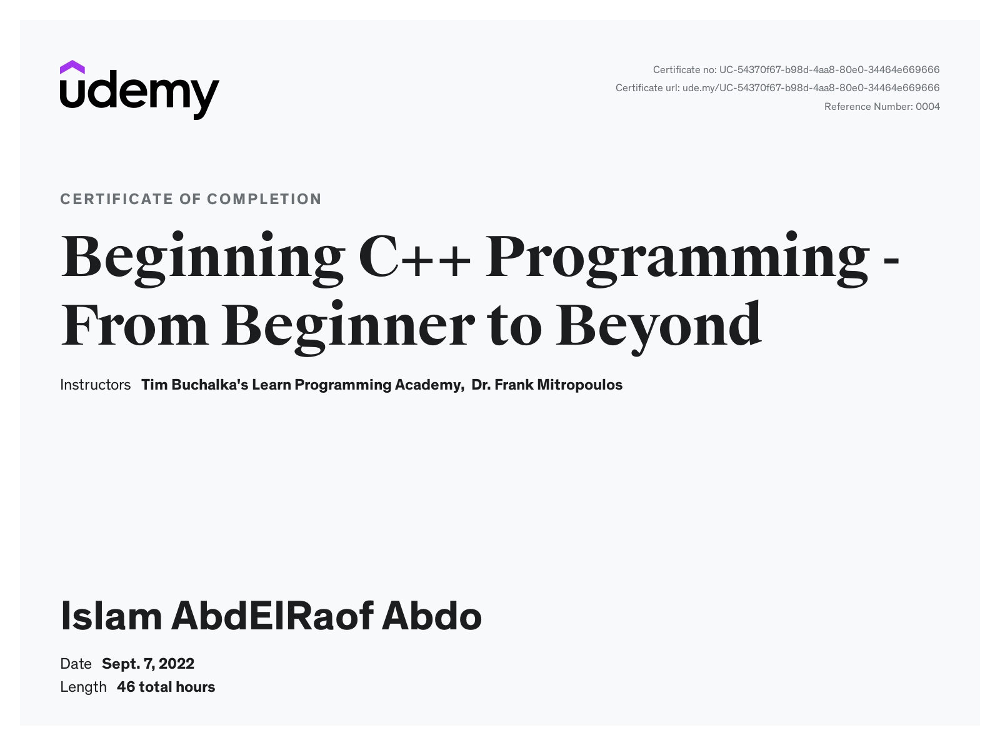

# Beginning C++ Programming - From Beginner to Beyond
This repository contains the solutions to the challenges and exercises from the [Beginning C++ Programming - From Beginner to Beyond](https://www.udemy.com/course/beginning-c-plus-plus-programming/) course on Udemy.

## Course Overview
The course covers a wide range of topics, including:

- Variables and Basic Types
- Strings, Vectors, and Arrays
- Expressions
- Statements
- Functions
- Classes
- Arrays and Pointers
- Dynamic Memory
- Operators and Overloading
- Inheritance and Polymorphism
- Templates
- And more!

Each section of the course includes theory lectures, as well as practical examples and exercises to help you apply the concepts you've learned.

## Repository Structure
The repository is organized by section, with each section containing subdirectories for each topic covered in that section. Within each topic directory, you'll find the solved code for the exercises and examples covered in the course.

## Certifications
I have successfully completed the Beginning C++ Programming - From Beginner to Beyond course on Udemy and earned the following certifications:

[Certificate of Completion](https://www.udemy.com/certificate/UC-54370f67-b98d-4aa8-80e0-34464e669666/)

Please feel free to contact me if you have any questions or concerns about the code in this repository or my certifications.

Thank you for checking out my repository!